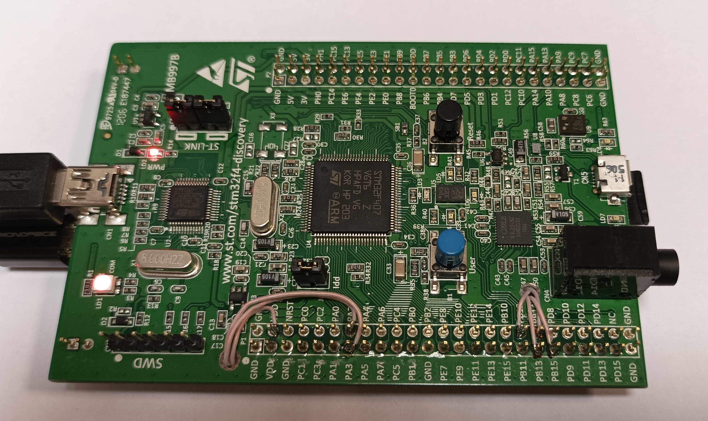
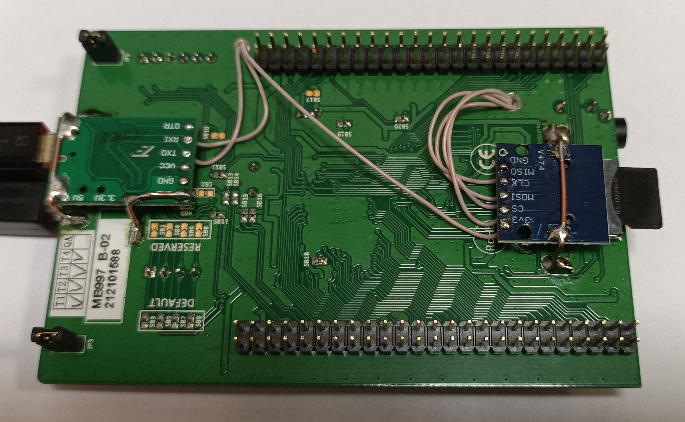
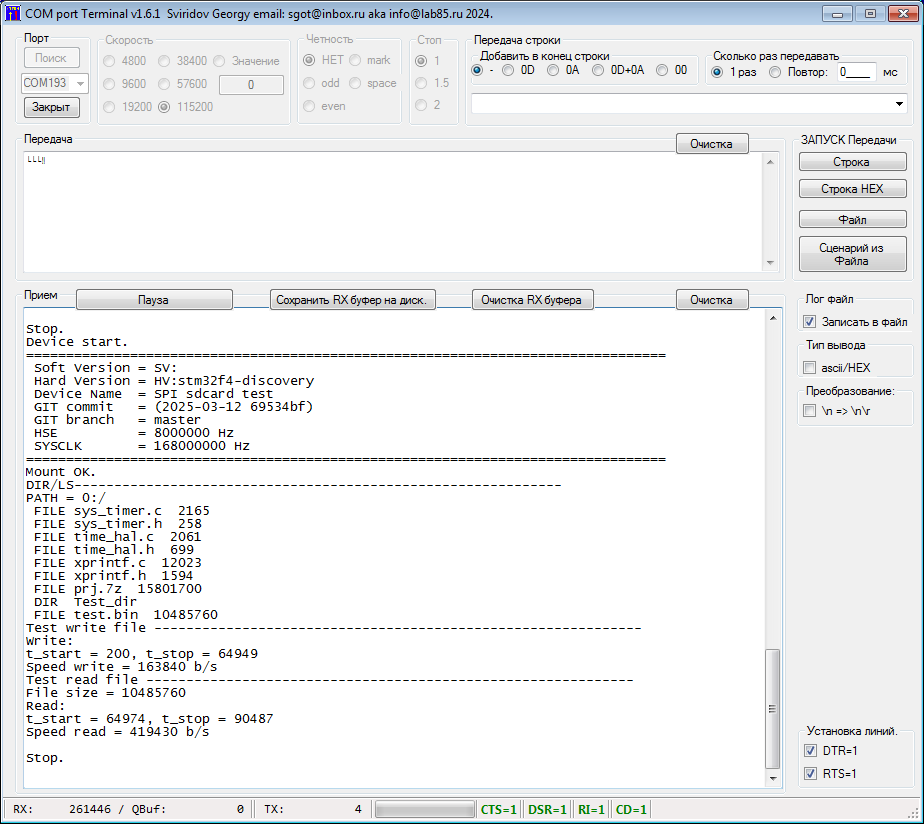

# stm32f4-discovery_sdcard_spi
Stm32f4-Discovery - STM32F407
Add my SDCARD(SPI mode) + USB UART CH340G

u2tx     - PA2
u2rx     - PA3
spi2clk  - PB13
spi2miso - PB14
spi2mosi - PB15
spi2cs   - PB12 (software cs)

NO rtos, Uart console(115200 8n1)
spi(8bit) + FatFs + xprintf

-------------------------------------------------------------------------------
Board parameter:
 HSI = 16MHz (all hard modules -> 16 MHz)
 fask spi clk = 8 MHz, SPI=8bit

Test 1:
Create Bin file, size = 15Mb
write file size = 15Mb t_start = 383, t_stop = 133839 Speed write = 118260 b/s

Test 2:
read file size = 15801700, t_start = 487, t_stop = 77619 Speed read = 205216 b/s

-------------------------------------------------------------------------------
Board parameter:
 HSE = 8MHz -> (CORE=168 MHz APB1=42MHz)
 fask spi clk = 42/2=21 MHz

Test 1:
Create Bin file, size = 10Mb
write file size = 10Mb, t_start = 200, t_stop = 64949 Speed write = 163840 b/s 

Test 2:
read file size = 10Mb, t_start = 64974, t_stop = 90487 Speed read = 419430 b/s

-------------------------------------------------------------------------------
-------------------------------------------------------------------------------
Board parameter:
 HSI = 16MHz (all hard modules -> 16 MHz)
 fask spi clk = 8 MHz, SPI=16bit

Test 1:
Create Bin file, size = 10Mb
write file size = 10 Mb, t_start = 281, t_stop = 85148 Speed write = 124830 b/s

Test 2:
read file size = 10 Mb, t_start = 85182, t_stop = 134274 Speed read = 213995 b/s

-------------------------------------------------------------------------------
Board parameter:
 HSE = 8MHz (CORE=168 MHz APB1=42MHz)
 fask spi clk = 42/2=21 MHz, SPI=16bit

Test 1:
Create Bin file, size = 10Mb
write file size = 10Mb, t_start = 1459, t_stop = 64511 Speed write = 166440 b/s

Test 2:
read file size = 10Mb, t_start = 64549, t_stop = 88646 Speed read = 436906 b/s

-------------------------------------------------------------------------------

